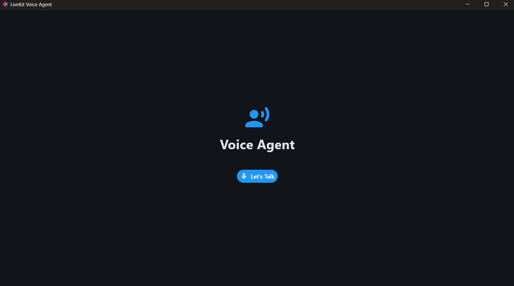
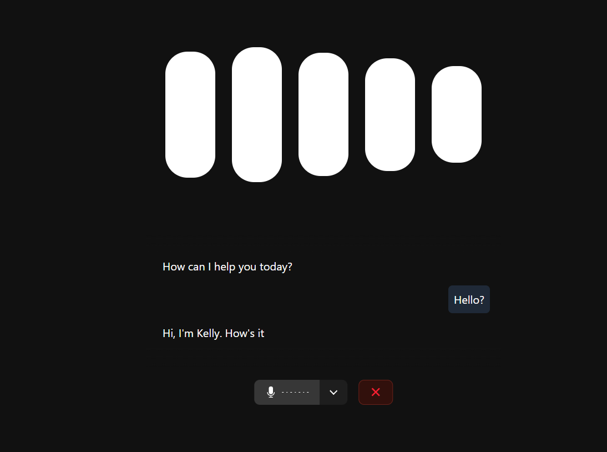

## LiveKit Voice Agent with Flet

This project consists of two main components:

1. **agent.py**: A LiveKit-based voice assistant agent that connects to a LiveKit server, Deepgram/groq processes voice input , generates responses using a groq LLM, and returns audio output using Deepgram/groq TTS.
2. **app.py**: A Flet-based desktop/web UI that:

   * Launches `agent.py` as a background process (with a "dev" argument).
   * Provides a user interface with a "Let's Talk" button.
   * Opens the LiveKit sandbox URL in the system browser (desktop).

---

## Prerequisites

* Python 3.8 or higher
* A virtual environment (recommended)
* LiveKit server credentials (API key and secret)
* Deepgram API key
* Groq API key
* Livekit Credentials/key


---

## Setup

1. **Clone the repository**:

   ```bash
   git clone https://github.com/MdSufiyan005/flet-livekit.git
   cd livekit-flet-voice-agent
   ```

2. **Create and activate a virtual environment**:

   ```bash
   python -m venv venv
   # Windows
   venv/Scripts/activate
   # macOS/Linux
   source venv/bin/activate
   ```

3. **Install dependencies**:

   ```bash
   pip install --upgrade pip
   pip install -r requirements.txt
   ```

4. **Environment variables**:
   Create a `.env` file in the project root with the following variables:

   ```dotenv
   LIVEKIT_URL=your_livekit_url
   LIVEKIT_API_KEY=your_livekit_api_key
   LIVEKIT_SECRET=your_livekit_secret
   DEEPGRAM_API_KEY=your_deepgram_api_key
   GROQ_API_KEY=your_groq_api_key
   ```
---

## Running the Application

1. **Start the Flet UI** (this also spawns the agent process):

   ```bash
   python app.py
   ```

   This will:

   * Launch `agent.py dev` in the background
   * Open the Flet window with the "Let's Talk" button

2. **Interact**:

   * Click **Let's Talk** to open the LiveKit sandbox URL in your default browser (desktop) or embedded WebView (mobile/macOS).
   * Speak into your microphone; the agent will respond via synthesized speech.

---

## Images 






## Project Structure

```text
├── agent.py          # Voice assistant entrypoint and LiveKit agent setup
├── app.py            # Flet UI with background agent launcher and browser 
├── requirements.txt  # Python dependencies
├── .env.example      # Example environment variable template
└── README.md         # This file
```

